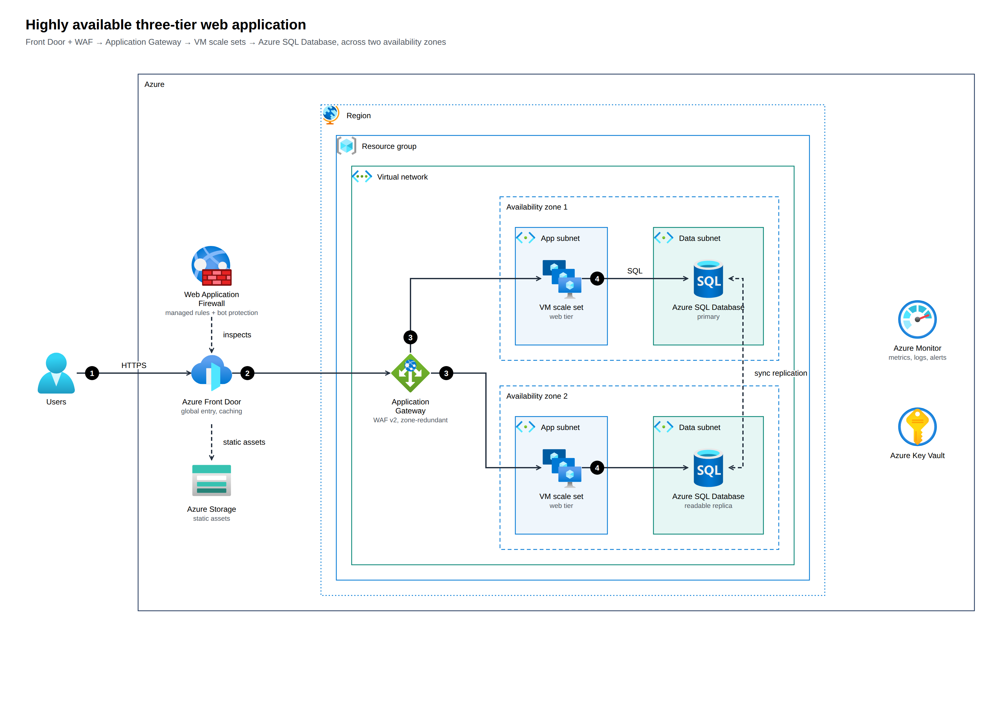
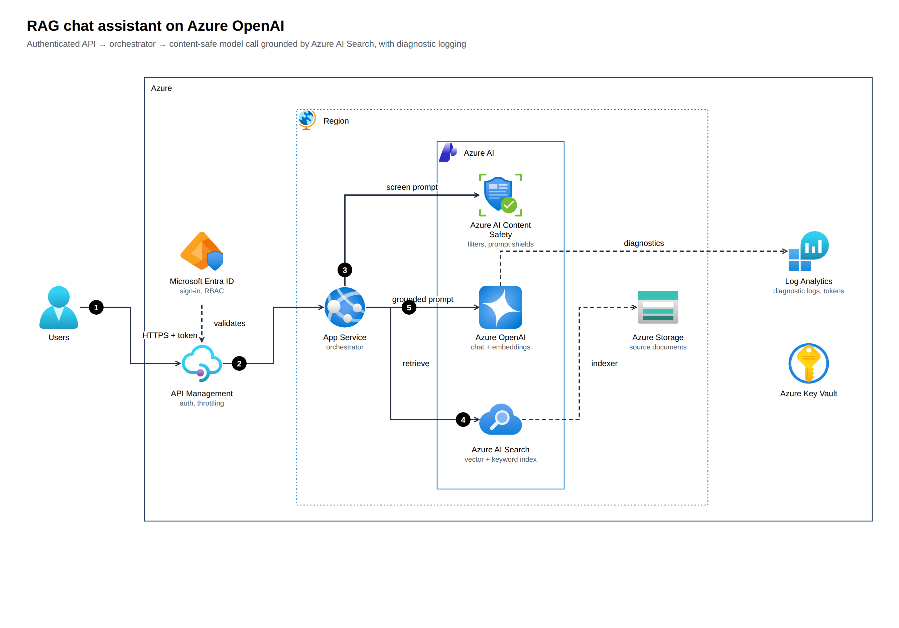

# archify-azure

Generate **Azure architecture diagrams** from a typed JSON spec — using the **official Azure Architecture Icons**, an
Azure Architecture Center-style group/arrow/label look, a **monthly cost estimate** from the Azure Retail Prices API and an
advisory **Azure Well-Architected Framework** review. A companion to [tt-a1i/archify](https://github.com/tt-a1i/archify)
and the Azure sibling of [archify-aws](https://github.com/akashtalole/archify-aws): describe the system, get a standalone,
explorable HTML (plus SVG/PNG/draw.io) and a receipt of what was checked.

| Three-tier on two zones | RAG assistant on Azure OpenAI |
|---|---|
|  |  |

Enterprise product catalog search (hybrid keyword + vector search on Azure AI Search, event-driven indexing):
[architecture](examples/out/product-catalog-search.png) · [page with cost and review](examples/out/product-catalog-search.html) ·
[draw.io file](examples/out/product-catalog-search.drawio)

Serverless API: [architecture](examples/out/serverless-api.png) · Agent tool call: [sequence](examples/out/agent-tool-call.sequence.png) ·
Clinical notes: [dataflow](examples/out/clinical-notes.dataflow.png)

## Quick start
```bash
git clone https://github.com/akashtalole/archify-azure && cd archify-azure
npm run icons:fetch                                  # official icon package → assets/azure-icons/ (git-ignored)
node bin/archify-azure.mjs render examples/genai-rag.json --png --drawio
open examples/out/genai-rag.html           # tabs: Diagram · Cost · Well-Architected review
open "examples/out/genai-rag.html?tab=wa"
```
Node ≥ 20, **no npm dependencies**. PNG export needs Chrome/Chromium (`CHROME_PATH` or a Playwright browser).

### Use it from an AI agent
`SKILL.md` is an agent skill (same shape as Archify's). Point your agent at this repo and say, e.g.:
*"Use archify-azure to diagram a zone-redundant web app on AKS with Azure SQL, estimate the monthly cost, and review it against the Well-Architected pillars."*
The agent searches icons, authors the spec, runs `finalize --json`, repairs failures, looks at the PNG, and reports.

## What you get
* **Official icons** — 539 Azure service icons, 97 general icons and 8 group icons (SVG, unmodified); `icons search`, aliases (`functions`, `aks`, `cosmos`, `apim`, `front-door`…).
* **Azure groups** — Azure, management group, subscription, region, resource group, virtual network, subnets, NSG, availability zone/set, on-premises, custom service groups; 12px Arial labels (≤ 2 lines); open-arrow orthogonal connectors; numbered callouts (hover for the description); light and dark themes.
* **Layout + routing** — nest groups, list children; rows align icon centre lines; the router avoids nodes and group headers, prefers straight lines, and warns (exit code 2 with `--strict`) when it can't find a clean route.
* **Three diagram types** — `architecture`, `sequence` (lifelines, boundaries, fragments), `dataflow` (stage columns).
* **Cost tab** — monthly estimate from the public **Azure Retail Prices API** (pay-as-you-go list prices) for ~25 services (Functions, App Service, VMs, Storage, Cosmos DB, SQL Database, Service Bus, Event Hubs, API Management, Application Gateway, Front Door, AI Search, Azure OpenAI / Foundry models, AKS, Redis, Key Vault, Log Analytics…), with assumptions, sensitivity and what-ifs (Functions Flex Consumption, SQL zone redundancy, OpenAI batch, Blob Cool tier). All arithmetic is code; unmodelled services say so.
* **Well-Architected review tab** — the 5 Azure pillars and 59 recommendations (`RE:05`, `SE:07`…): five statuses, impact × likelihood risk, Eisenhower plan, SMART goals, AI-workload findings. Advisory: it reads the *drawing*, not your configuration.
* **draw.io export** — a `.drawio` file using draw.io's own Azure icons (`img/lib/azure2/…`) and styled group containers; fully editable.
* **`finalize`** — validate → render → strict checks → real-browser check → PNG → deterministic `*.receipt.json`. Never claims visual quality: it records `visualReview: "not-performed"`.
* **Viewer runtime** — click a node for its Passport; Reach, Route probe, Finder (`/`), presentation (`p`), deep links (`#focus=orch&reach=downstream`, `#route=a~b`), export to PNG/JPEG/WebP/SVG/draw.io. See [references/viewer-runtime.md](references/viewer-runtime.md).
* **Import** — `import mermaid` (flowchart + sequenceDiagram → Azure icons, with mapping confidence) and `import iac` (Terraform `azurerm`, Bicep, ARM → architecture; resolves Event Grid subscriptions, API Management backends, diagnostic settings…). See [references/importers.md](references/importers.md).
* **Schemas + routing** — `schema` (JSON Schemas for editors/agents), `guide "<scenario>"` (which type and template).

## Cost and Well-Architected review
Every example under `examples/` is regenerated with both tabs. The architecture examples carry illustrative `usage` (stated in `meta.cost.note`) so the Cost tab shows real numbers: three-tier ≈ $1,792/mo, serverless API ≈ $474, RAG on Azure OpenAI ≈ $1,962, product catalog search ≈ $4,822. Treat them as demonstrations, not quotes.

Use `--no-cost` / `--no-review` to omit the tabs, `archify-azure cost` and `archify-azure wa review` for the CLI, and `?tab=cost|wa` to deep-link.

## Commands
```text
archify-azure finalize <spec.json> [--json]      archify-azure render <spec.json> [-o out.html] [--svg] [--png] [--drawio] [--theme dark] [--no-review] [--strict] [--json]
archify-azure validate <spec.json>              archify-azure review <spec.json>            archify-azure export <spec.json> --format drawio
archify-azure cost <spec.json> [--scale 1,3,10]  archify-azure wa review|corpus
archify-azure import mermaid <file|-> | import iac <dir>       archify-azure guide "<scenario>"      archify-azure schema <type>
archify-azure icons search|info|categories|groups
archify-azure init three-tier|serverless-api|genai-rag|sequence|dataflow      archify-azure fetch-icons | doctor
```
Spec format: [references/spec.md](references/spec.md) · Azure conventions: [references/azure-diagram-guidelines.md](references/azure-diagram-guidelines.md) ·
review rules: [references/well-architected.md](references/well-architected.md) · cost: [references/cost-estimation.md](references/cost-estimation.md).

```json
{ "meta": { "title": "Hello Azure" },
  "root": { "layout": "row", "children": [
    { "id": "u", "icon": "users", "label": "Users" },
    { "id": "cloud", "kind": "azure-cloud", "children": [
      { "id": "fn", "icon": "functions", "label": "Azure Functions" },
      { "id": "db", "icon": "cosmos", "label": "Azure Cosmos DB" } ] } ] },
  "edges": [ { "from": "u", "to": "fn", "step": 1, "label": "HTTPS" }, { "from": "fn", "to": "db", "step": 2 } ] }
```

## Documentation
User guide and developer guide (MkDocs): <https://akashtalole.github.io/archify-azure/> — source in [`docs/`](docs/); build locally with
`pip install -r requirements-docs.txt && node scripts/stage-docs.mjs && mkdocs serve`.

## Notes and limits
* **Icons are not committed.** Microsoft distributes them under its own terms; `icons:fetch` pulls the Azure Architecture Icons V24
  package from Microsoft. Rendered diagrams embed the icons they use. See [THIRD_PARTY_NOTICES.md](THIRD_PARTY_NOTICES.md).
* Azure has no published group-style deck: group colours and corner icons follow Azure Architecture Center conventions and are a house style.
* Prices are list prices from the Retail Prices API (snapshot in `data/prices/eastus.json`; `npm run prices:fetch` refreshes it). Not a quote.
* Not a drop-in for Archify's pipeline: this is an independent Azure-specific renderer. `finalize` is the equivalent gate here.
* The router is heuristic. Complex diagrams may need `children` reordering; the warnings say where.
* `npm test` runs the unit and example-render tests (needs the icons fetched).

MIT licensed.
