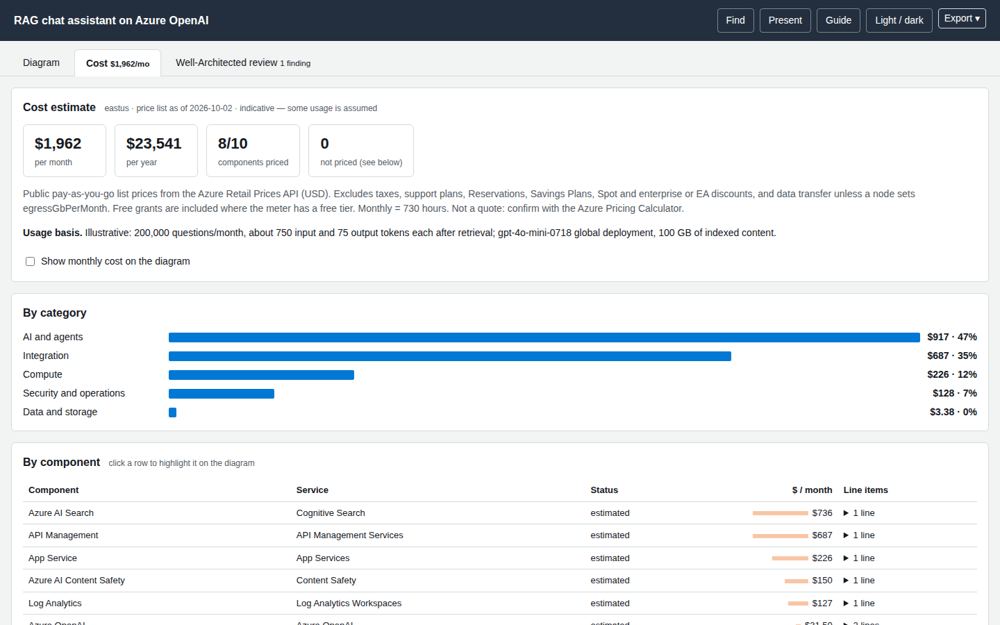

# Cost estimate

The **Cost** tab estimates monthly cost from the **public Azure Retail Prices API** (pay-as-you-go list prices, USD). It is deterministic code, never a model's arithmetic, and every number can be traced to a rate, a quantity and an assumption.



## What the tab shows

* **Totals** per month and per year, how many components were priced, and how many were not.
* **By category** (compute, data and storage, AI and agents, …) and **by component**, with every line item expanded as `quantity × rate = cost` and the meter id.
* **Assumptions** — every input is tagged **from spec** (you stated it) or **assumed** (a default). Any defaulted input makes the estimate **indicative**.
* **Sensitivity** at 1×, 3× and 10× traffic, and **what-ifs** (Functions Flex Consumption, SQL zone redundancy, Azure OpenAI batch deployments, Blob Cool tier) where they apply.
* **Provenance**: the effective date of each price list and the retrieval date.
* A checkbox that overlays `$/mo` on the diagram.

## Giving it real numbers

Put a `usage` object on each node. Anything you leave out falls back to a documented default and is flagged as assumed.

```json
{ "id": "fm", "icon": "openai", "label": "Azure OpenAI",
  "usage": { "model": "gpt-4o-0806", "inputTokensPerMonth": 150000000, "outputTokensPerMonth": 15000000 } }
```

Describe the scenario once in `meta.cost.note` so readers know the basis:

```json
"meta": { "title": "…", "cost": { "region": "eastus", "note": "Illustrative: 200,000 questions/month, ~750 input and 75 output tokens each" } }
```

### Usage keys by service

| Service | Keys (default) |
|---|---|
| Azure Functions | `plan` (`consumption`, `flex`, `premium`), `requestsPerMonth` (1e6), `avgDurationMs` (200), `memoryMb` (512); premium: `instances` (1), `vcpu` (1), `memoryGb` (3.5) |
| Azure App Service | `sku` (`P1v3`), `os` (`linux`/`windows`), `instances` (2) |
| Azure Virtual Machines | `vmSize` (`Standard_D2s_v5`), `count` (2), `hoursPerMonth` (730) |
| Azure Storage (Blob) | `accessTier` (`hot`, `cool`…), `redundancy` (`LRS`…), `storageGb` (100), `writeOperationsPerMonth` (1e5), `readOperationsPerMonth` (1e6) |
| Azure Cosmos DB | `mode` (`provisioned` or `serverless`), `ruPerSecond` (1000), `storageGb` (50), `regions` (1) |
| Azure SQL Database | `tier` (`general-purpose` or `business-critical`), `vcores` (2), `zoneRedundant` (false), `storageGb` (100) |
| Azure Service Bus | `tier` (`standard`, `premium`), `messagingUnits` (1), `operationsPerMonth` (5e6) |
| Azure Event Hubs | `tier` (`standard`), `throughputUnits` (1), `ingressEventsPerMonth` (1e7) |
| Azure API Management | `tier` (`standard`, `consumption`…), `callsPerMonth` (1e6), `units` (1) |
| Azure Application Gateway | `waf` (true), `avgCapacityUnits` (3) |
| Azure Front Door | `tier` (`standard`/`premium`), `egressGbPerMonth` (100), `requestsPerMonth` (1e7) |
| Azure Key Vault | `operationsPerMonth` (1e5) |
| Azure Monitor Log Analytics | `ingestGbPerMonth` (10), `retentionDays` (31), `retainedGb` (10) |
| Azure AI Search | `sku` (`standard-s1`), `searchUnits` (3) |
| Azure OpenAI / Foundry models | **`model` is required** (for example `gpt-4o-0806`, `gpt-5-mini`, `text-embedding-3-small`), `deployment` (`global`, `regional`, `datazone`), `mode` (`standard` or `batch`), `inputTokensPerMonth` (5e6), `outputTokensPerMonth` (1e6), `cachedInputTokensPerMonth` (0) |
| Azure Document Intelligence | `feature` (`read`…), `pagesPerMonth` (10000) |
| Azure AI Content Safety | `textRecordsPerMonth` (1e5), `imagesPerMonth` (0) |
| Azure Cache for Redis | `tier` (`standard`), `size` (`C1`), `instances` (1) |
| Azure Kubernetes Service | `tier` (`free`/`standard`/`premium`), `nodeVmSize` (`Standard_D4s_v5`), `nodeCount` (3) |
| Azure Container Registry | `sku` (`standard`) |
| Azure Firewall | `sku` (`standard`), `dataProcessedGbPerMonth` (100) |
| Azure Bastion | `sku` (`basic`) |
| Azure Event Grid | `operationsPerMonth` (5e6) |
| Azure Load Balancer | `rules` (5) |
| Azure Public IP | `count` (1) |

Model names are matched exactly or as a **unique prefix**; an ambiguous name is an error that lists the candidates, never a guess.

Two keys work on **any** node:

* `usage.monthlyUsd` — supply the monthly cost yourself (status *override*). Use it for services without a cost model, and say where the number came from.
* `usage.egressGbPerMonth` — adds internet data-transfer-out.

## Honest statuses

| Status | Meaning |
|---|---|
| `estimated` | Priced from the price list with the stated and assumed inputs. |
| `override` | You supplied `usage.monthlyUsd`. |
| `no-charge` | The service has no direct charge (virtual networks, NSGs, managed identities, Azure Policy…). |
| `not-billable` | A general icon (users, internet), not an Azure resource. |
| `not-itemized` | the price list has no separate meter for it. |
| `needs-input` | A required input is missing (for example the Azure OpenAI `model`). |
| `not-estimated` | No cost model for this service yet. Supply `usage.monthlyUsd` to include it. |
| `error` | The price book could not resolve an unambiguous rate; the reason is shown. |

The total only includes priced components, and the tab says how many were left out.

## What is and is not included

Included: public pay-as-you-go rates; 730 hours per month; free grants that the API lists as zero-price tiers (for example Functions' monthly free executions). **Excluded**: taxes, support plans, Reservations, Savings Plans, Spot, Azure Hybrid Benefit, enterprise agreements and credits, and data transfer unless you set `egressGbPerMonth`. Treat the result as a planning number and confirm it in the [Azure Pricing Calculator](https://azure.microsoft.com/pricing/calculator/).

## From the command line

```bash
archify-azure cost spec.json                       # table in the terminal
archify-azure cost spec.json --scale 1,3,10        # sensitivity points
archify-azure cost spec.json --region eastus      # needs data/prices/<region>.json
archify-azure cost spec.json --usage usage.json    # {"<nodeId>": {…usage keys…}} overrides the spec's usage
archify-azure cost spec.json --json                # full machine-readable result
```

Turn the tab off with `render --no-cost` / `finalize --no-cost`.

The price snapshot is committed (`data/prices/eastus.json`, 28 price lists). Developers refresh it with `npm run prices:fetch`; see [Data refresh](../developer-guide/data-refresh.md).
