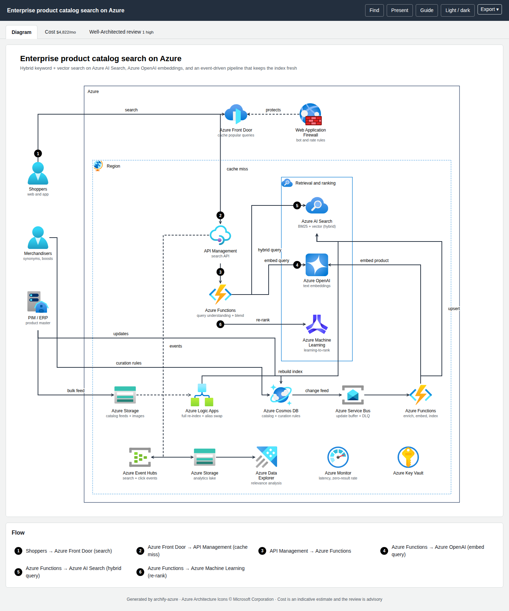

# Examples

Each example is a spec in the repository's `examples/` folder, rendered to a live page you can open (diagram, cost and review tabs, draw.io download). Specs carry **illustrative** usage; the cost note on each page says what was assumed. They are demonstrations, not quotes.

## Architecture

| Example | What it shows | Page | draw.io |
|---|---|---|---|
| Three-tier web app | Two zones, Front Door + WAF, Application Gateway, VM scale sets, Azure SQL zone-redundant, Key Vault | [open](../live/three-tier.html) | [file](../live/three-tier.drawio) |
| Serverless API | Entra External ID, API Management, Functions, Cosmos DB, Service Bus | [open](../live/serverless-api.html) | [file](../live/serverless-api.drawio) |
| RAG assistant on Azure OpenAI | Content Safety, model deployment, AI Search vector index, diagnostic logging | [open](../live/genai-rag.html) | [file](../live/genai-rag.drawio) |
| **Product catalog search** | Hybrid keyword + vector search on Azure AI Search, Azure OpenAI embeddings, event-driven indexing | [open](../live/product-catalog-search.html) | [file](../live/product-catalog-search.drawio) |



## Sequence and dataflow

| Example | Type | Page |
|---|---|---|
| Agent tool call with content safety and approval | sequence | [open](../live/agent-tool-call.sequence.html) |
| Clinical notes pipeline | dataflow | [open](../live/clinical-notes.dataflow.html) |

## Imported

| Example | Source | Page |
|---|---|---|
| Orders flow | Mermaid flowchart | [open](../live/mermaid-orders-flow.html) |
| Checkout | Mermaid sequence | [open](../live/mermaid-checkout.sequence.html) |
| Terraform stack | `examples/iac/terraform/` (`azurerm_*`) | [open](../live/iac-terraform.diagram.html) |
| Bicep file | `examples/iac/bicep/` | [open](../live/iac-bicep.diagram.html) |

## Regenerate

```bash
npm run icons:fetch
node bin/archify-azure.mjs finalize examples/product-catalog-search.json
npm run examples          # re-renders every examples/*.json to examples/out/
```
