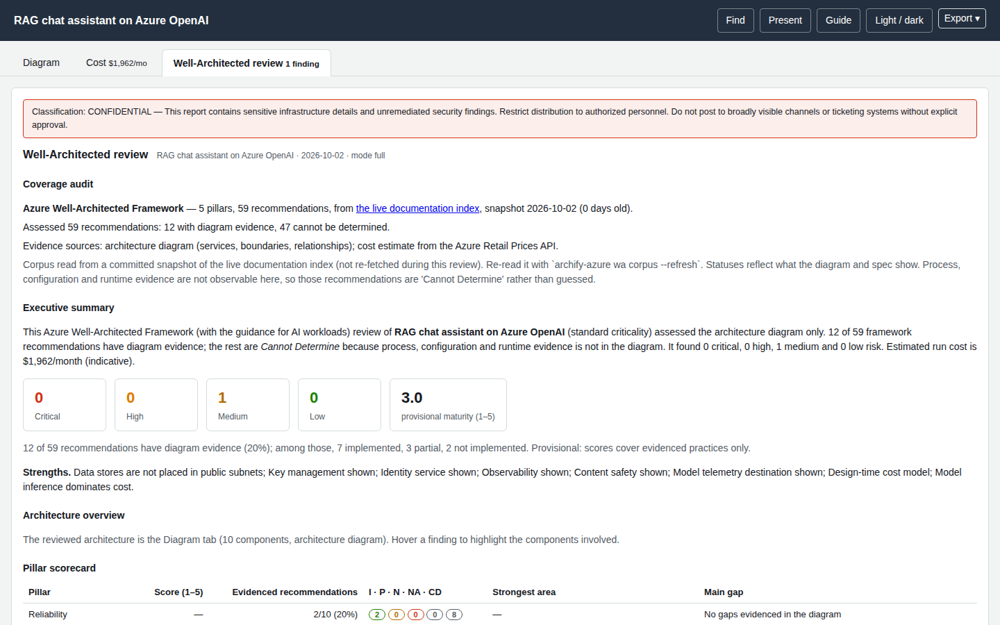

# Well-Architected review

The **Well-Architected review** tab assesses your diagram against the **Azure Well-Architected Framework** (5 pillars, 59 recommendations) and flags AI-workload findings when the diagram contains Azure OpenAI, Foundry, AI Search or Machine Learning. The structure — frozen corpus, five statuses, impact × likelihood, Eisenhower prioritisation, SMART goals — follows the AWS `aws-well-architected-review` skill, applied to Azure.



!!! warning "A diagram is not the workload"
    The review reads **which services and boundaries you drew and how they connect**. It cannot see configuration, process or runtime behaviour. Most best practices therefore stay **Cannot Determine** — that is reported, never hidden — and the maturity score is *provisional*. It does not certify compliance.

## How an assessment is built

1. **A frozen corpus.** Pillars and recommendation IDs are scraped from the Azure Well-Architected Framework pillar checklist pages on Microsoft Learn and snapshotted in `data/wa/framework.json`. IDs are canonical (`RE:05`, `SE:07`, `CO:12`, `OE:07`, `PE:05`) and are never invented. Azure has no question level, so the tables group by pillar. The tab shows the snapshot date and age.
2. **One status per BP**, from five:

    | Status | Used when |
    |---|---|
    | **Implemented** | The diagram (or cost estimate) shows the practice. |
    | **Partially Implemented** | Shown in part, or shown but with a gap. |
    | **Not Implemented** | The diagram shows the opposite (for example a database in a public subnet). |
    | **Not Applicable** | The practice does not apply to this architecture. |
    | **Cannot Determine** | The diagram is not evidence either way. A hint says what evidence is needed (process, IaC/configuration, runtime). |

3. **Risk = impact × likelihood** for each gap:

    | | Likelihood Low | Medium | High |
    |---|---|---|---|
    | **Impact Severe** | High | High | **Critical** |
    | **Moderate** | Medium | Medium | High |
    | **Minor** | Low | Low | Medium |

    A workload `criticality` of `critical` raises impact for Security and Reliability gaps; `low` softens Reliability. Something that is merely *not drawn* is less certain than a drawn defect, so its likelihood is reduced and it appears under **To confirm** instead of as a finding.
4. **Prioritisation (Eisenhower).** Importance is high for Critical/High risks; effort is low or not. The quadrants are **Do First**, **Plan**, **Delegate**, **Defer**, each finding has an owner and a SMART goal with a target date and a success measure.
5. **Pillar scores 1–5** = 1 + 4 × (implemented + ½ partial) ÷ evidenced BPs, shown only when at least three BPs are evidenced, and marked *provisional* when under 25 % of the pillar is evidenced.

## What the tab contains

Following the skill's report template, top to bottom:

* a **CONFIDENTIAL** classification banner (the report describes unremediated findings; do not post it in broadly visible places);
* **Coverage audit** — corpus source and age, how many recommendations were assessed, evidenced and undeterminable, and the evidence sources used (the diagram, and the cost estimate when present);
* **Executive summary** with counts per risk, strengths, and the provisional maturity score;
* **Pillar scorecard**;
* **Per-question table** with status, risk and key evidence;
* the full **best-practice ledger** — every BP, no truncation, filterable by status, pillar and free text;
* **Findings** grouped Critical → Low, each with evidence, impact × likelihood, recommendation, priority and owner;
* **To confirm** — things not drawn, which may exist but be undrawn;
* **Cross-pillar trade-offs** computed from the cost estimate (for example the cost of zone redundancy against reliability, or Content Safety spend against safety);
* the **Eisenhower matrix**, **remediation plan** with SMART goals, and **next steps**.

## Controlling it

```bash
archify-azure wa review spec.json                          # full review in the terminal
archify-azure wa review spec.json --mode score             # scorecard only
archify-azure wa review spec.json --mode pillar --pillars security,reliability
archify-azure wa review spec.json --filter critical-high   # hide Medium/Low findings
archify-azure wa review spec.json --criticality high --json
```

| Option | Values |
|---|---|
| `--mode` | `full` (default); `pillar` (full detail for the pillars in `--pillars`); `quick` and `score` (scorecards and findings, without the per-question and per-BP tables) |
| `--pillars` | pillar ids such as `security,reliability` (with `--mode pillar`) |
| `--filter` | `all`, `critical-high`, `critical` |
| `--criticality` | `low`, `standard`, `high`, `critical` (or `meta.workload.criticality`) |
| `--no-cost` | do not include cost evidence |

In the spec: `meta.workload` (`name`, `criticality`, `description`), `meta.lens`, and `meta.guardrails: true` when content-safety controls exist outside the drawing. `meta.review: false`, or `--no-review` on `render`/`finalize`, removes the tab.

## Reading the result sensibly

* A short list of findings is not "good". Look at the **coverage audit**: with 11 of 59 recommendations evidenced, five out of five on a pillar means "nothing wrong in what is drawn", not "mature".
* Do not add decorative icons to turn a finding green. Either the control really exists (add it with its connection) or it is out of scope.
* Use **To confirm** as a checklist for the architecture review conversation.
* The AI-workload rules recognise content safety, vector stores, model request logging, private endpoints, agent tool governance and human review when they are drawn and named plainly.

## Corpus

```bash
archify-azure wa corpus                       # counts and snapshot age
archify-azure wa corpus --refresh             # re-read the live Microsoft Learn pages (network)
```

A refresh runs the skill's validation gate (canonical IDs, no duplicates, every recommendation belongs to a known pillar and carries that pillar's prefix, every pillar has at least one recommendation, no pillar holds over 60 % of all recommendations) and refuses to save an invalid corpus.
